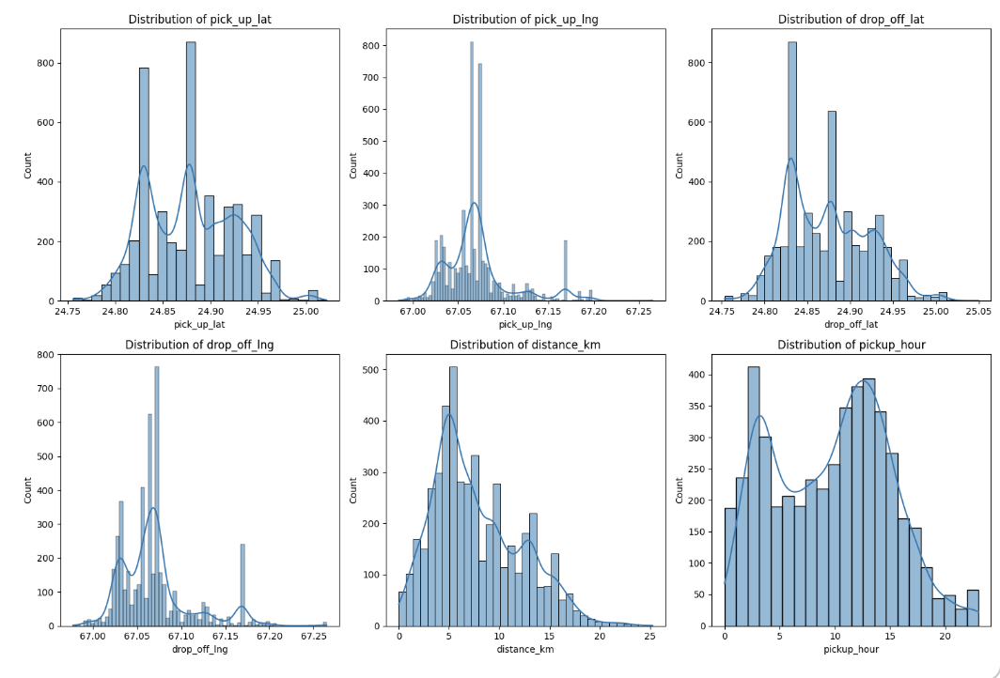
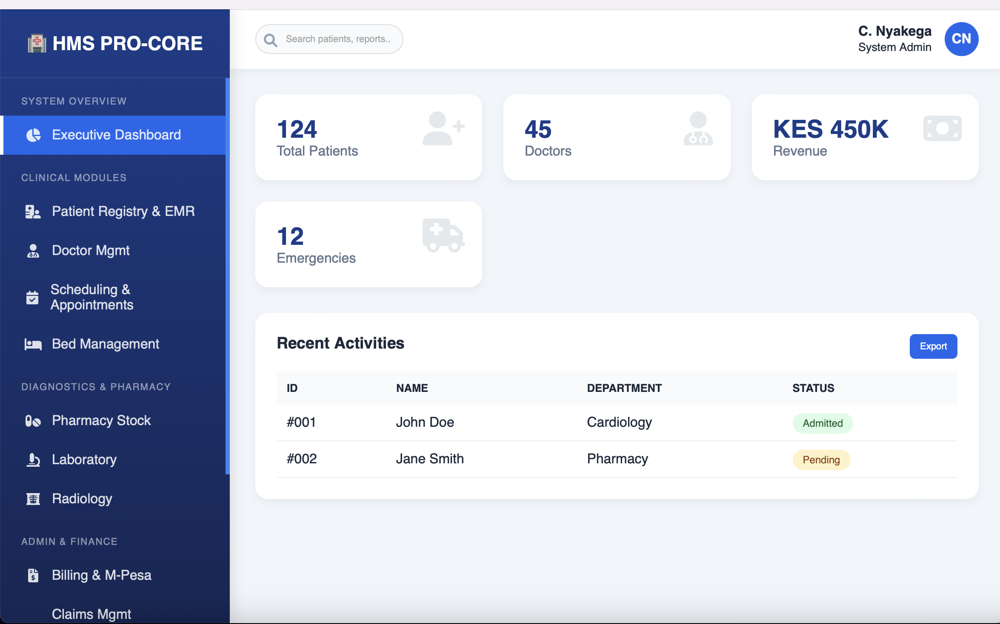
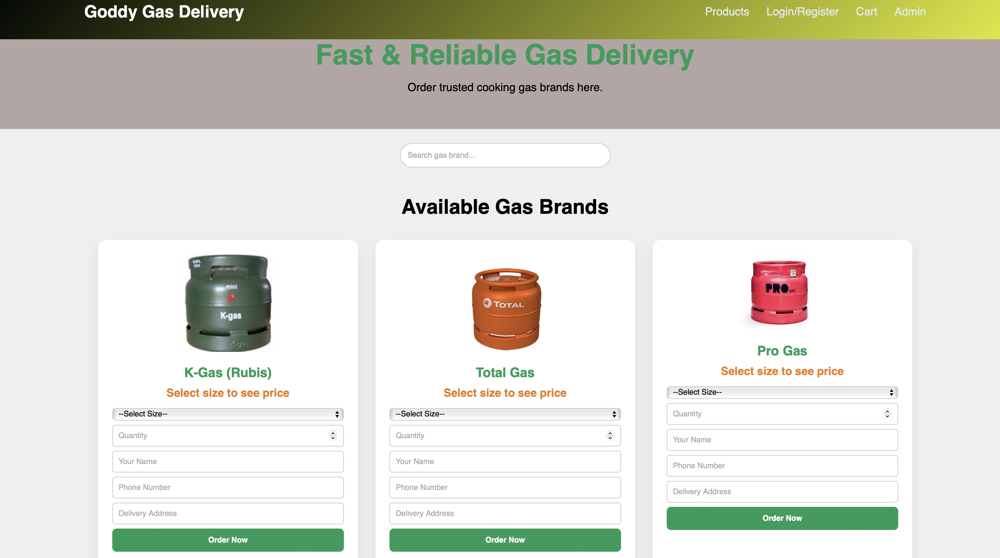

## Portfolio
I’m a Data Scientist, Software Developer, and Research Consultant who transforms data and technology into practical solutions. My experience spans data analytics, business intelligence, machine learning, climate data management, software development, and ICT support. I enjoy solving real-world problems, building useful digital solutions, and helping organizations turn complex information into actionable insights that drive better decisions and growth.
## SKILLS
**Data Science & Analytics;**
Data Analysis, Machine Learning, Statistical Analysis, Predictive Analytics, Data Cleaning, Data Visualization, and Research Analytics.

**Business Intelligence;**
Power BI, Dashboard Development, KPI Reporting, Business Reporting, Data-Driven Decision Making, and Performance Analysis.

**Programming & Databases;**
Python, R, SQL, Java, STATA, MySQL, SQLite, Database Management, and Data Processing.

**Software & Web Development;**
PHP, JavaScript, HTML, CSS, Software Development, Web Applications, Database Integration, and System Testing.

**Data Engineering & Automation;**
ETL, Data Pipelines, Data Transformation, Workflow Automation, Data Quality, and Database Optimization.

**GIS & Climate Data;**
ArcGIS, Climate Data Management, Spatial Data Analysis, CHIRPS Data Analysis, and Hydrometeorological Data Processing.

**ICT & Technical Support;**
ICT Support, Hardware and Software Troubleshooting, Networking Support, System Administration, User Support, and Technical Problem Solving.

**Professional Skills;**
Research, Analytical Thinking, Problem Solving, Communication, Teamwork, Attention to Detail, Stakeholder Engagement, Adaptability, and Time Management.

## MY PORTFOLIO

A glimpse of some of the projects I've been working on.

 **Logistic regression model for predicting Ride-hailing customer churn.**

 

 
 [Read more](ride-hailing.ipynb)
 
## Hotel Management System
 
  
  
 [Read more](https://github.com/Nyakega/HOTEL-WEB-PROJECT)
 
## Hospital Management System
 
 
 
 [Read more](https://github.com/Nyakega/Hospital-Management-System)
 
## LPG Gas Delivery & Ordering Management System

 
 
 
 [Read more](https://github.com/Nyakega/LPG-Gas-Delivery-Odering-System)
 
## Python Desktop ERP – Quotation & Invoice Management System

 
 
 [Read more]()
 
## Contact Details

 <table border="0">
  <tr>
    <td width="30" align="center">📧</td>
    <td><a href="mailto:cristophernyakego3@gmail.com">cristophernyakego3@gmail.com</a></td>
  </tr>
  <tr>
    <td width="30" align="center">📞</td>
    <td><a href="tel:+254707249537">+254 707 249 537</a> / <a href="tel:+254716858360">+254 716 858 360</a></td>
  </tr>
  <tr>
    <td width="30" align="center">📍</td>
   <td>Nairobi / Nairobi County, Kenya</td>
    <td>Mombasa / Mombasa County, Kenya</td>
  </tr>
  <tr>
    <td width="30" align="center">📥</td>
    <td><a href="assets/resume.pdf"><strong>Download my CV / Resume (PDF)</strong></a></td>
  </tr>
  <tr>
    <td width="30" align="center">🌐</td>
    <td><a href="https://www.linkedin.com/in/cristopher-nicholas-9b3584240">Connect with me on LinkedIn</a></td>
  </tr>
</table>
 <a href ="">Download the Resume/CV Here(pdf file)</a>
